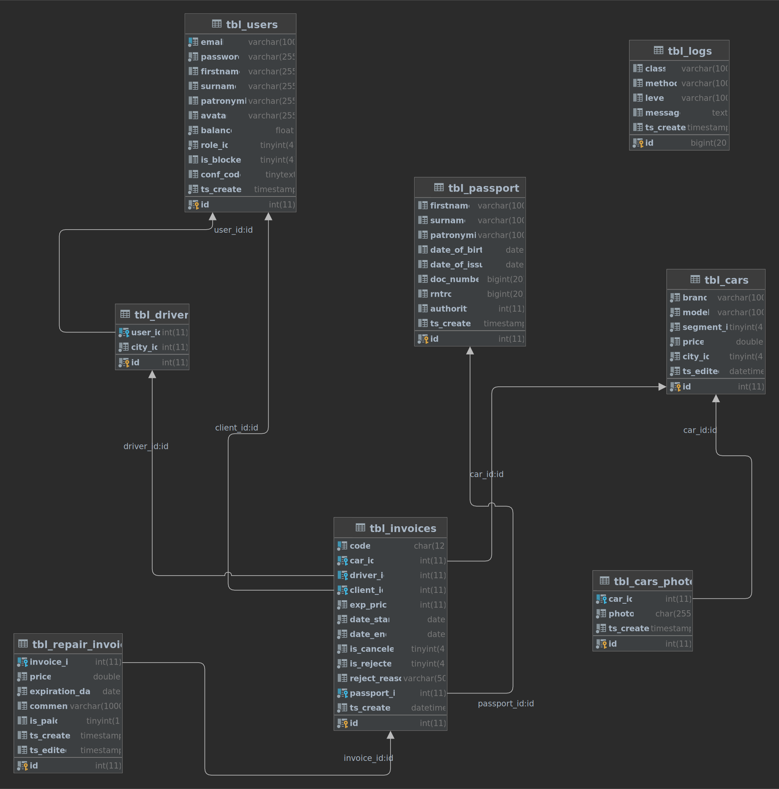

<div>

</div>
<div>
Car renting service developed as final project for <a href="https://www.epam.com/">&#x3c;EPAM&#x3e;</a>.
</div>
<div>
The client side actively uses <a href="https://vuejs.org/">Vue.js</a> 
and the server side is built on top of pure <a href="https://tomcat.apache.org/">Tomcat Servlets</a> 
with an <a href="https://ru.wikipedia.org/wiki/Model-View-Controller">MVC pattern</a> implementation.
</div>

## Table of contents
1. [Motivation](#motivation)
2. [Want to try?](#want-to-try)
3. [Key features](#key-features)
4. [Required functionality](#required-functionality)
5. [Detailed features description](#detailed-features-description)
   1. [Introduction page](#-introduction-page)
   2. [Registration page](#-registration-page)
   3. [Login page](#-login-page)
   4. [Profile page](#-profile-page)
   5. [Client invoices panel](#-my-invoices-client-invoices-panel)
   6. [Manager-panel](#-manager-panel)
   7. [Admin-panel](#-admin-panel)
   8. [Driver-panel](#-driver-panel)
   9. [Renting page](#-renting-page)
6. [About new driver system](#about-new-driver-system)
7. [Glossary](#glossary)
8. [Database structure](#database-structure)

## Motivation
While developing the project, I wanted not only to meet the objectives, but also to expand the project to a state where it could be fully used in real life. 
For this reason, the description of the project below will not be limited to the list of required functionality and a few features that I made.
I went further and divided the project into modules, so as not to miss all the details and describe the functionality in as much detail as possible.

## Want to try?
To test an application, all you need is a [Docker](https://www.docker.com/) and a CRRT repository.

#### Demo setup:

1. Clone current repository.
2. Run:
   ```console
   docker-compose up
   ```
3. 🌀 Checkout demo on `http://localhost:8080/crrt_war`!

#### Available roles:
- 🌑 **Admin**: 
  - email: admin@crrt.com
  - password: admin1
- 🌒 **Manager**:
  - email: manager@crrt.com
  - password: manager1
- 🌓 **Driver #1**
  - email: driver@crrt.com
  - password: driver1
- 🌔 **Driver #2**
  - email: driver2@crrt.com
  - password: driver2
- 🌕 **Client (customer)**
  - email: client@mail.ua
  - password: client1

## Key features

♾️️️ Active use of [Vue.js](https://vuejs.org/) for the client side and the tremendous work done to create a good design

✅ Driver system designed to automate the distribution of orders among drivers and manage them

☑️ Custom reactive fields validation module

✅ Custom sorting module, allowing different sequential sorting by many columns

☑️ Recaptcha protection

✅ Password restoration via JWT tokens and email confirmation feature

☑️ Export reports to Excel file

✅ Ubiquitous user notification via email

☑️ Dark and light appearance modes

✅️ All sensitive data encryption, including passwords

☑️ Integration and unit tests presence

✅️ DAO layer unit-testing via H2 in-memory database and MySQL database (the latter for specific tests)

☑️ Usage of Mockito framework

✅️ User authentication through "Guards" (work through handy annotations)

☑️ Comments not only on non-trivial methods and classes, but also inside each service method

✅️ Logging to rolling-file and database

✴️️ And much more
> Read more about features [here](#detailed-features-description).
## Required functionality
1. <span id="reqf_1"></span> There is a list of Cars in the system, for which it is necessary to implement: 
   - choice by brand; 
   - choice according to quality class; 
   - sort by rental price; 
   - sort by name.

2. <span id="reqf_2"></span>The customer registers in the system, chooses a car and makes a rental order.

3. <span id="reqf_3"></span> An unregistered customer cannot place an order.

4. <span id="reqf_4"></span> In the order data the client indicates passport data, option 'with driver' / 'without driver', lease term. 

5. <span id="reqf_5"></span> The system generates an Invoice, which the client pays. 

6. <span id="reqf_6"></span> The manager reviews the order and may reject it, giving a reason. 

7. <span id="reqf_7"></span> The manager also registers the return of the car, in case of car damage he issues an invoice for repairs through the system. 

8. <span id="reqf_8"></span> The system administrator has the rights: 
   - adding, deleting cars, editing car information; 
   - blocking / unblocking the user; 
   - registration of managers in the system.


## Detailed features description
As I said in the section "[Motivation](#motivation)", my goal was to make a viable product, which is why it was implemented a lot of interesting functionality, 
such as a separate module of driver management, driver panel, renting "availability" of certain cars on dates ranges, etc. 

All that stuff is described in more detail in the appropriate categories.

### 🔷 Introduction page
#### From requirements:
Fully satisfied [#1](#reqf_1) and [#3](#reqf_3).
#### Additions:
1. Added "[flexible sorting](#flex_sort)" for columns "Vehicle name", "Segment" (class), "Price". 
2. Ability to filter by city (vehicles are connected to cities).
3. You can select dates on which you want to rent a car and system will show only cars, available for renting on specified dates range.
4. You can filter by minimal and maximal price range. 

### 🔷 Registration page
#### From requirements:
> No requirements specified for registration page.
#### Additions:
1. Added custom fields validation by multiple conditions (module: "[Smart validation](#smart_val)").
2. Ability to show and hide entered password.
3. Captcha protection added.
4. User should agree with "terms of use" before creating account.
5. After successful registration, system sends confirmation email to user.

### 🔷 Login page
#### From requirements: 
> No requirements specified for login page.
#### Additions:
1. Added custom email validation. (module: "[Smart validation](#smart_val)").
2. Added "Remember me" ability.
3. Ability to restore password. (see: ).

### 🔷 Profile page
#### From requirements:
> That page was not specified at any requirements list.

#### Functionality: 
1. Ability to change user avatar and delete it, if needed.
2. Ability to update user data, such as _firstname_, _surname_, _patronymic_.
3. Ability to change password.
4. Ability to replenish balance.

### 🔷 My invoices (client invoices panel)
#### Short description:
Here client can review detailed information about his invoices, 
cancel them and pay repairment invoices, connected to these invoices.

#### From requirements:
> That page was not specified at any requirements list.

#### Functionality: 
1. Clients can search their rents.
   > Search can be done for rent codes, vehicle name and dates range.
2. Clients have ability to cancel specific rent, if needed.
3. Clients can pay for repairment invoices, connected to the rents.

### 🔷 Manager-panel
#### From requirements: 
Fully satisfied [#6](#reqf_6) and [#7](#reqf_7).
#### Additions: 
1. Ability to search by **code**, **vehicle name**, **dates range**, **price**, **driver** (added with new driver system),
**client**, **invoice status**.
2. Added "[flexible sorting](#flex_sort)" for columns **vehicle name**, **dates range**, **price**.
3. Ability to export all invoices data into **Excel** file. (all exporting setting can be easily configured at appropriate properties file).
4. Ability to get full information about specific invoice.
5. Ability to set expiration date to repairment invoice.
6. Ability to remove repairment invoices and, if client already paid it, refund money (in that case, client will be notified via email about money refund).

### 🔷 Admin-panel
#### From requirements:
Fully satisfied: 
- [#6](#reqf_6) and [#7](#reqf_7) (because invoices management panel comes from manager-panel).
- [#8](#reqf_8).
#### Additions:
- Global project statistics like _active rents_, _new rents_, _monthly profit_ shown in a pretty way.
- Ability to add car photos when creating car.
- Ability to add and delete car photos when editing car information.
- Ability to create new users, specifying all needed information.
- Ability to change all user information, including password + view some additional info about user profile, like _balance_, _invoices amount_ and _registration date_.
- Ability to change user roles to _client_, _driver_, _manager_ and _admin_.
- Admin, the same as managers, has access to invoice management panel, which was cloned to admin-panel for faster access.
   > To tell the truth, the implementation of the panel itself has been changed to make it more convenient to use in the admin panel page.

### 🔷 Driver-panel
For more information read [here](#about-new-driver-system).
#### Short description: 
This page was not meant to be an option, but I decided to add it to make the system more automated.
#### From requirements:
> That page was not specified at any requirements list.

#### Functionality:
- Page contains stats panel, where driver can check it`s _upcoming rents amount_, _current dislocation city_, _expected salary_.
- Page has "rents management panel", but with limited information and functionality. There driver can check: 
  - Renting dates.
    > With more information about the duration of the order, as well as how long it will take for the order to start.
  - Vehicle name.
  - Expected salary. (percentage can be configured at project properties).
  - Rent city.
  - Rent statuses.
- Additionally, at that panel driver has ability to delegate (skip) rent to another driver, if system can find suitable one.
- Driver, of course, has ability to change his dislocation city, if, for example, he moved from Kyiv to Lviv and wants to continue working here.

### 🔷 Renting page
#### From requirements:
Fully satisfied [#2](#reqf_2), [#3](#reqf_3), [#5](#reqf_5).
#### Additions:
- Car`s photos gallery.
- Renting dates picker.
   > Its peculiarity is that it does not allow you to select dates for which the current transport is already booked.
- Ability to select "with driver" / "without driver" taking into account the availability of drivers at the current location (depending on the selected vehicle) and the current date range.
- All inputs related to passport data are validated. (module: "[Smart validation](#smart_val)")
- If the client does not have enough money, the ability to pay will be blocked and the client will be notified of exactly how much to put on the account.
- When invoice is generated and paid, system send email about successful payment to client`s email and, if client selected "with driver", system will notify the driver about new rent in his list.

## About new driver system
The new driver system, which was not specified in the requirements, is designed to automate the process of managing drivers and assigning them to orders. 
It allows drivers to manage coupled orders and, for example, to delegate them to other drivers (if the system can find a suitable driver for that order). 

The "rents management panel" for drivers has a useful functionality to work with rents, view statistics and change the city in which the driver works.

This system also allows to prohibit the client to set "with driver" in the order, if no suitable drivers are found.

## Glossary
| Name	                                          | Definition	                                                                                                                                                                                                                                                                                               |
|------------------------------------------------|-----------------------------------------------------------------------------------------------------------------------------------------------------------------------------------------------------------------------------------------------------------------------------------------------------------|
| <span id="flex_sort"><span/> Flexible sort   | Sorting module which allows sorting in ascending or descending order by multiple columns with remembering of sort order. In other words, you can, for example, firstly, sort by price in ascending order, then by vehicle name in descending order and then, for example, by segment in ascending order.	 |
| <span id="smart_val"><span/> Smart validation	| Vue.js based custom validation of fields with ability to specify multiple conditions. Validates data at real-time. Conditions are shown on the page, which allows user to get information about validation conditions. 	                                                                                  |

## Database structure
You can get empty database `.sql` file [here](crrtdbEmpty.sql).

